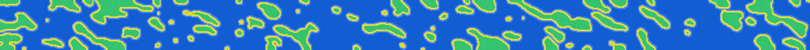
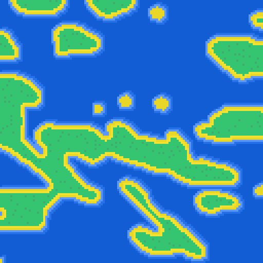
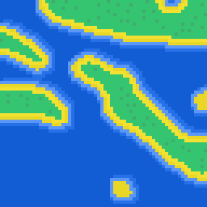
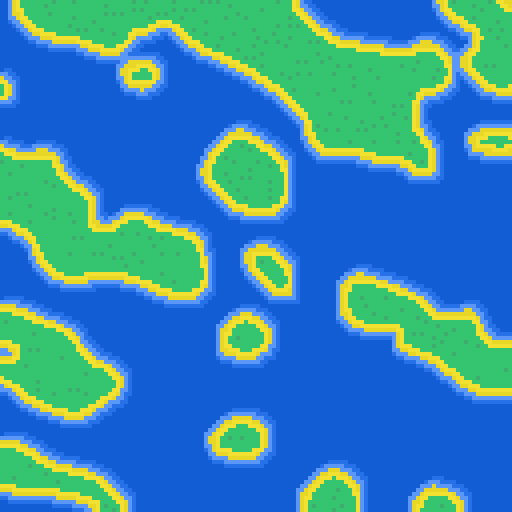
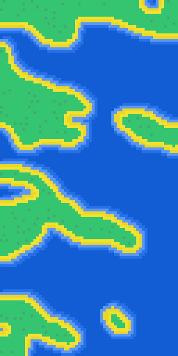

# Islander

Islander is a **procedural island generator** written in Rust.

---

Islander doesn't use the usual _Perlin Noise_, but instead uses an algorithm made from scratch and perfected with trial and error.



## Usage

Firstly, **download the latest executable from the Releases**, or install it from Cargo
```shell
cargo install --git=https://github.com/0xF1dev/islander.git
```

Then, to quickly generate a 128x128 image, simply run the executable
```shell
islander
```

This will save the image in `output.png`.

### Options

#### Resolution
Islander supports resolutions from _16x16_ up to _1024x1024_ (due to performance). To set a resolution, use the `-s` option:
```shell
islander -s [width]x[height]
```
_Note: high resolutions can take over a minute to generate._

#### Output file
Islander saves images in PNG. To specify the filename, use the `-o` option:
```shell
islander -o [filename]
```

#### Upscaling
Islander allows images to be upscaled using the `--upscale` option and specifying a multiplier. For example:
```shell
islander -s 256x256 --upscale 4
```
This will save both the original 256x256 image and the 4x upscaled 1024x1024 image.

#### Seed
To use a set seed and get reproducible images, use the `--seed` option:
```shell
islander --seed [seed]
```
_Even with set seeds, images differ when using different resolutions._

## Example images

**128x128, upscaled 4x to 512x512**




**64x64, upscaled 4x to 256x256**




**Seed "islander", 128x128, upscaled 4x to 512x512**




**Vertical 64x128, upscaled 4x to 256x512**


